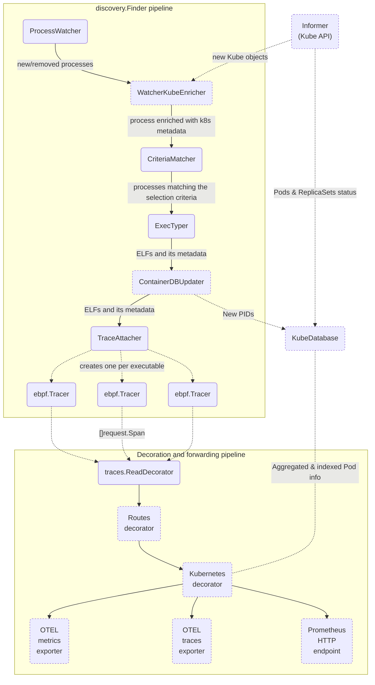

# Beyla pipeline map

The whole Beyla pipeline is divided in two main connected pipelines. The reason for not having a
single pipeline is that there are plans to split Beyla into two: a finder/instrumenter executable
with high privileges and a reader/decorator executable with lesser privileges.

The dashed boxes are optional stages that will run only under certain conditions/configurations.

Check the in-code documentation for more information about each symbol.

