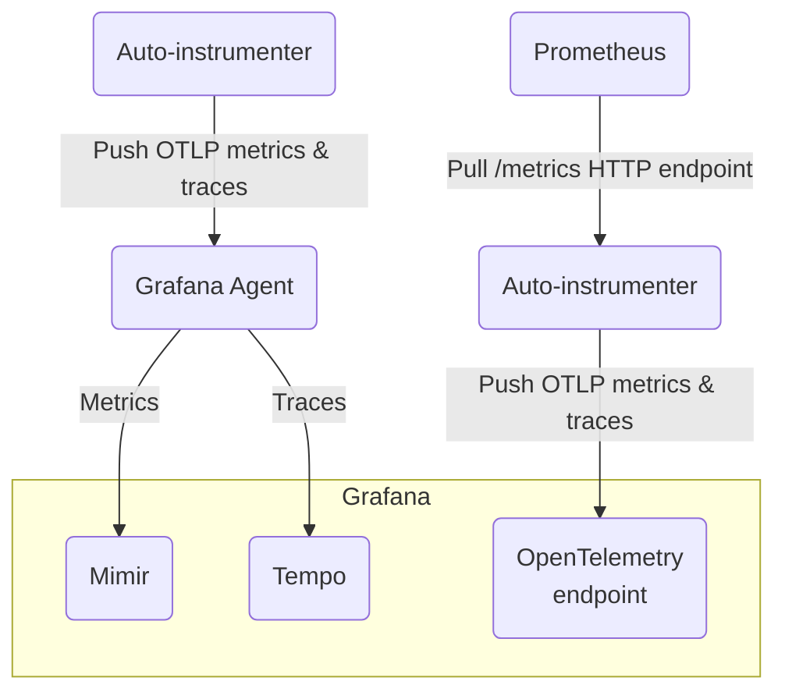
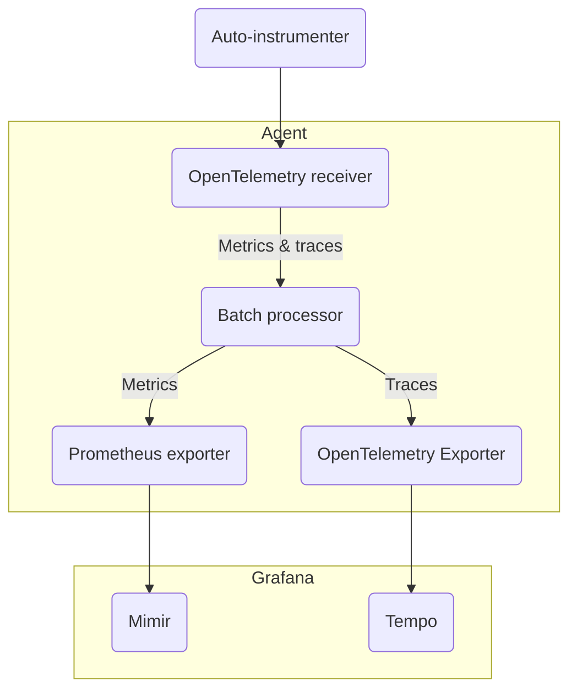

# Agent mode vs. direct mode

> ⚠️ this is a live document. Some parts might change in the future as long as we provide new ways
of packaging and installing the Auto-instrumenter.

The eBPF auto-instrumenter can work in two operation modes:

* **Agent mode** (recommended mode): the auto-instrumenter will send the metrics and traces to the
  [Grafana Agent](https://github.com/grafana/agent), which will process and send them
  to Grafana. In this scenario, the Agent takes care of the authentication in the Grafana endpoint.
  It also integrates better with some Grafana exclusive features, such as the span-to-metrics and
  span-to-service graph converters (**TODO**: add links).
* **Direct mode**: the auto-instrumenter can **push** the metrics and/or traces directly to a remote endpoint
  (using the OpenTelemetry, OTEL, protocol) or just expose a Prometheus HTTP endpoint ready to be scraped (**pull** mode).
  In direct OTEL push mode, the auto-instrumenter needs to be configured with the authentication data.


<center><i>eBPF auto-instrumenters running in Agent mode (left) and Direct mode (right)</i></center>

## Running in Direct mode

You can follow our [quickstart tutorial]() for a quick introduction
to the eBPF auto-instrumenter running in Direct mode using OpenTelemetry. You will find there how to provide
an OTLP endpoint and authentication credentials by means of the following environment
variables:

* `OTEL_EXPORTER_OTLP_ENDPOINT`
* `OTEL_EXPORTER_OTLP_HEADERS`

To run in direct mode using the Prometheus scrape endpoint, please refer to the
[configuration documentation]().

## Running in Agent mode

> ℹ️ This tutorial assumes that both the Agent and the Auto-instrumenter are installed
as normal OS executable files. For examples about downloading and running the
autoinstrumenter as a container, you can check the documentation about
[running the eBPF autoinstrumenter as a Docker container]()
or [running the eBPF autoinstrumenter in Kubernetes]().

First, you need to locally install and configure the [Grafana Agent in **Flow** mode, according to the latest documentation](/docs/agent/latest/flow/).
It's important to run it in Flow mode as it will facilitate the ingest of OpenTelemetry
metrics and traces from the auto-instrumenter, as well as their processing and forwarding
to the different Grafana endpoints.

### Configuring the Agent pipeline

First, you need to specify the following nodes by using the
[River configuration language](/docs/agent/latest/flow/config-language/):



You can download the [example of the whole River configuration file](./agent-config.river), which will be explained in the rest of this section.

The Agent needs to expose an **OpenTelemetry receiver** endpoint so the
Auto-instrumenter can forward there both metrics and traces. The Agent
configuration file will need to include this entry:

```hcl
otelcol.receiver.otlp "default" {
  grpc {}
  http {}

  output {
    metrics = [otelcol.processor.batch.default.input]
    traces = [otelcol.processor.batch.default.input]
  }
}
```

This enables OpenTelemetry messages via both GRPC and HTTP, which will be
forwarded to the next stage in the pipeline, the **Batch processor** that
will simply accumulate the messages and forward them to the exporters:

```hcl
otelcol.processor.batch "default" {
  output {
    metrics = [otelcol.exporter.prometheus.default.input]
    traces  = [otelcol.exporter.otlp.tempo.input]
  }
}
```

You can export either metrics, traces, or both. If you only want to export a single
type of data, you can just avoid the `metrics` or `traces` lines in the previous
node definitions, and ignore some of the following exporters.

The metrics are **exported in Prometheus** format to [Grafana Mimir](/oss/mimir/).
The configuration entry will need to specify an endpoint with basic
authentication. In the provided example, the endpoint and credentials are
provided via environment variables, to avoid leaking them into a plain text file:

```hcl
otelcol.exporter.prometheus "default" {
    forward_to = [prometheus.remote_write.mimir.receiver]
}

prometheus.remote_write "mimir" {
  endpoint {
    url = "https://" + env("MIMIR_ENDPOINT") + "/api/prom/push"
    basic_auth {
      username = env("MIMIR_USER")
      password = env("GRAFANA_API_KEY")
    }
  }
}
```

So you will need to run the Agent with the following environment variables. For example:

```
export MIMIR_USER=734432
export MIMIR_ENDPOINT=prometheus-prod-01-eu-west-0.grafana.net
export GRAFANA_API_KEY=VHJhbGFyw60gcXVlIHRlIHbD....=
```

And finally, to **export the traces** format, you need to setup a
[Grafana Tempo](/oss/tempo/) exporter
and endpoint, also configured via environment variables:

```hcl
otelcol.exporter.otlp "tempo" {
    client {
        endpoint = env("TEMPO_ENDPOINT")
        auth     = otelcol.auth.basic.creds.handler
    }
}
    
otelcol.auth.basic "creds" {
    username = env("TEMPO_USER")
    password = env("GRAFANA_API_KEY")
}
```

Please consider that the `TEMPO_ENDPOINT` and `TEMPO_USER` values are different
than `MIMIR_ENDPOINT` and `MIMIR_USER`.

To run the agent with the previous configuration (for example, written in a file
named `agent-config.river`), you need to run the following command:

```
agent run agent-config.river
```

### Configuring and running the Auto-instrumenter

Now we can configure the auto-instrumenter to forward data directly to the Agent.
In this tutorial we are assuming that both the Auto-instrumenter and the Agent are
running in the same host, so there is no need to secure the traffic nor provide
authentication in the Agent OTLP receiver.

You can configure the Auto-instrumenter both via environment variables or via
a configuration YAML file, which is what we will use in this example.
Please refer to the complete [Configuration documentation]() for
more detailed description of each configuration option.

You can download the whole [example configuration file](./instrumenter-config.yml),
which we will explain in the rest of this section.

First, you need to specify the executbale to instrument. If, for example,
the service executable is a process that opens the port `443`, you can use the `open_port`
property in the `ebpf` section of the YAML document:

```yaml
ebpf:
  open_port: 443
```

The auto-instrumenter will automatically search and instrument the process opening
that port.

Then you need to specify where the traces and the metrics will be submitted. If
the agent is running in the local host, it will use the port `4318`:

```yaml
otel_metrics_export:
  endpoint: http://localhost:4318
otel_traces_export:
  endpoint: http://localhost:4318
```

You can specify both `otel_metrics_export` and `otel_traces_export` properties to
allow exporting both metrics and traces, or only one of them to export either
metrics or traces.

To run the Auto-instrumenter (previously installed via `go install github.com/grafana/ebpf-autoinstrument/cmd/otelauto@latest`), you need to specify the path to the
configuration YAML "for example, `instrumenter-config.yml`):

```
otelauto -config instrumenter-config.yml
```
