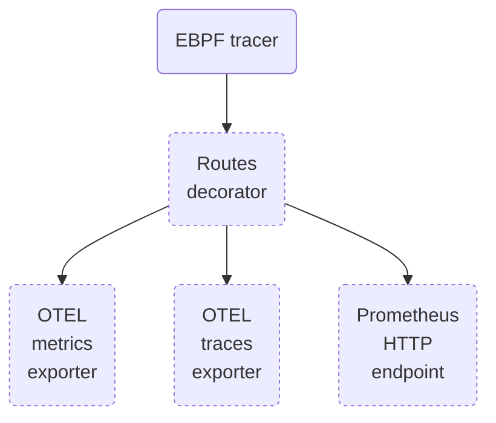

# Configuration

The Autoinstrumenter can be configured via environment variables or via
a YAML configuration file that is passed with the `config` command-line
argument. Environment variables have priority over the properties in the
configuration file. E.g.:

```
$ OPEN_PORT=8080 otelauto -config /path/to/config.yaml
```

At the end of this document, there is an [example of YAML configuration file](#yaml-file-example).

Currently, the Autoinstrumenter consist of a pipeline of components that
generates, transforms, and export traces from HTTP and GRPC services. In the
YAML configuration, each component has its own first-level section.

The architecture below shows the different components of the Autoinstrumenter.
Dashed boxes can be enabled and disabled according to the configuration.



A quick description of the components:

* [EBPF tracer](#ebpf-tracer) instruments the HTTP and GRPC services of an external Go process,
  creates service traces and forwards them to the next stage of the pipeline.
* [Routes decorator](#routes-decorator) will match HTTP paths (e.g. `/user/1234/info`)
  into user-provided HTTP routes (e.g. `/user/{id}/info`). If no routes are defined,
  the incoming data will be directly forwarded to the next stage.
* [OTEL metrics exporter](#otel-metrics-exporter) exports metrics data to an external
  [OpenTelemetry](https://opentelemetry.io/) metrics collector.
* [OTEL traces exporter](#otel-traces-exporter) exports span data to an external
  [OpenTelemetry](https://opentelemetry.io/) traces collector.
* [Prometheus HTTP endpoint](#prometheus-http-endpoint) sets an HTTP endpoint in the auto-instrumenter
  that allows any external scraper to pull metrics in [Prometheus](https://prometheus.io/) format.
* [Internal metrics reporter](#internal-metrics-reporter) optionally reports, [Prometheus](https://prometheus.io/)
  scrape endpoint, some metrics about the internal behavior of the autoinstrument.

Following sections explain both the global configuration properties, as well as
the options for each component.

## Global configuration properties

The properties in this section are first-level YAML properties, as they apply to the
whole Autoinstrumenter configuration:

| YAML        | Env var     | Type   | Default |
|-------------|-------------|--------|---------|
| `log_level` | `LOG_LEVEL` | string | `INFO`  |

Sets the level of the process standard output logger.

Valid values, from more to less verbose, are: `DEBUG`, `INFO`, `WARN` and `ERROR`

| YAML           | Env var        | Type    | Default |
|----------------|----------------|---------|---------|
| `print_traces` | `PRINT_TRACES` | boolean | `false` |
<a id="printer"></a>

If `true`, prints any instrumented trace via standard output.

## EBPF tracer

YAML section `ebpf`.


| YAML              | Env var           | Type   | Default |
|-------------------|-------------------|--------|---------|
| `executable_name` | `EXECUTABLE_NAME` | string | (unset) |

Selects the process to instrument by its executable name path. It will match
this value as a suffix.

This property will be ignored if the `open_port` property is set.

You need to be careful to choose a non-ambiguous name. If, for example, you set
`EXECUTABLE_NAME=server`, and you have running two processes whose executables
have the following paths:

```
/usr/local/bin/language-server
/opt/app/server
```

The Autoinstrumenter will match indistinctly one of the above processes. In that
case you could refine the value to `EXECUTABLE_NAME=/opt/app/server` or just
`EXECUTABLE_NAME=/server`.

| YAML        | Env var     | Type   | Default |
|-------------|-------------|--------|---------|
| `open_port` | `OPEN_PORT` | string | (unset) |


Selects the process to instrument by the port it opens.

This property takes precedence over the `executable_name` property.

It is important to consider that, if an executable opens multiple ports, you have to
specify only one of the ports and the Autoinstrumenter **will instrument all the
HTTP and GRPC requests in all the ports**. At the moment, there is no way to
restrict the instrumentation only to the methods exposed through a single port.

| YAML          | Env var       | Type    | Default |
|---------------|---------------|---------|---------|
| `system_wide` | `SYSTEM_WIDE` | boolean |  false  |


Causes instrumentation of all processes on the system. This includes all
existing processes, and all newly launched processes after the instrumentation
has been enabled.

This property is mutually exclusive with the `executable_name` and `open_port` properties.

At present time only HTTP (non SSL) requests are tracked and there's no support for gRPC yet.
When you are instrumenting Go applications, you should explicitly use `executable_name` or 
`open_port` instead of `system_wide` instrumentation. The Go specific instrumentation is of higher
fidelity and it incurs lesser overall overhead.

| YAML         | Env var          | Type   | Default |
|--------------|------------------|--------|---------|
| `wakeup_len` | `BPF_WAKEUP_LEN` | string | (unset) |

Specifies how many messages need to be accumulated in the eBPF ringbuffer
before sending a wakeup request to the user space.

In high-load services (in terms of requests/second), this will help reducing the CPU
footprint of the Autoinstrumenter.

In low-load services (in terms of requests/second), high values of `wakeup_len` could
add a noticeable delay in the time the metrics are submitted.

## Routes decorator

YAML section `routes.

This section can be only configured via YAML. If no `routes` section is provided in
the YAML file, the routes pipeline stage is not created and data will be bypassed
to the exporters.

| YAML       | Env var | Type            | Default |
|------------|---------|-----------------|---------|
| `patterns` | --      | list of strings | (unset) |

Will match the provided URL path patterns and set the `http.route` trace/metric
property accordingly with the matching path pattern.

Each route pattern is a URL path with some inserted marks that will group any path
segment to it. The matcher marks can be in the `:name` or `{name}` format.

For example, if you define the following patterns:

```yaml
routes:
  patterns:
    - /user/{id}
    - /user/{id}/basket/{product}
```

Traces with the following HTTP paths will include the same `http.route='/user/{id}'` property:

```
/user/123
/user/456
```

Traces with the following HTTP paths will include the same `http.route='/user/{id}'/basket/{product}`
property:

```
/user/123/basket/1
/user/456/basket/3
```

| YAML      | Env var | Type   | Default    |
|-----------|---------|--------|------------|
| `unmatch` | --      | string | `wildcard` |

Specifies what to do when a trace HTTP path do not match any of the `patterns` entries.

Its possible values are:

* `unset` will leave the `http.route` property as unset.
* `path` will copy the `http.route` field property to the path value.
  * 🚨 Caution: this option could lead to cardinality explosion at the ingester side.
* `wildcard` will set the `http.route` field property to a generic askterisk `*` value.

## OTEL metrics exporter

YAML section `otel_metrics`.

This component exports OpenTelemetry metrics to a given endpoint. It will be enabled if
its `endpoint` attribute is set (either via YAML or environment variables).

In addition to the properties exposed in this section, this component implicitly supports
the environment variables from the [standard OTEL exporter configuration](https://opentelemetry.io/docs/concepts/sdk-configuration/otlp-exporter-configuration/).

| YAML       | Env var                                                                    | Type | Default |
|------------|----------------------------------------------------------------------------|------|---------|
| `endpoint` | `OTEL_EXPORTER_OTLP_ENDPOINT` or<br/>`OTEL_EXPORTER_OTLP_METRICS_ENDPOINT` | URL  | (unset) |

Specifies the OpentTelemetry endpoint where metrics will be sent.

Using the `OTEL_EXPORTER_OTLP_ENDPOINT` env var sets a common endpoint for both the metrics and
[traces](#otel-traces-exporter) exporters. Using the `OTEL_EXPORTER_OTLP_METRICS_ENDPOINT` env var
or the `endpoint` YAML property will set the endpoint only for the metrics exporter node,
so the traces exporter won't be activated unless explicitly specified.

| YAML                   | Env var                     | Type | Default |
|------------------------|-----------------------------|------|---------|
| `insecure_skip_verify` | `OTEL_INSECURE_SKIP_VERIFY` | bool | `false` |

Controls whether the OTEL client verifies the server's certificate chain and host name.
If set to `true`, the OTEL client accepts any certificate presented by the server
and any host name in that certificate. In this mode, TLS is susceptible to machine-in-the-middle
attacks. This option should be used only for testing and development purposes.

| YAML           | Env var             | Type   | Default         |
|----------------|---------------------|--------|-----------------|
| `service_name` | `OTEL_SERVICE_NAME` | string | executable path |

Specifies the name of the instrumented service to be reported by the metrics exporter.
If unset, it will be the path of the instrumented service (e.g. `/usr/local/bin/service`).

| YAML       | Env var            | Type     | Default |
|------------|--------------------|----------|---------|
| `interval` | `METRICS_INTERVAL` | Duration | `5s`    |

Configures the intervening time between exports.

| YAML            | Env var                 | Type    | Default |
|-----------------|-------------------------|---------|---------|
| `report_target` | `METRICS_REPORT_TARGET` | boolean | `false` |

Specifies whether the exporter must submit `http.target` as a metric attribute.

According to the standard OpenTelemetry specification, `http.target` is the full HTTP request
path and query arguments.

It is disabled by default to avoid cardinality explosion in paths with IDs. As an alternative,
it is recommended to group these requests in the [routes node](#routes-decorator).

| YAML          | Env var               | Type    | Default |
|---------------|-----------------------|---------|---------|
| `report_peer` | `METRICS_REPORT_PEER` | boolean | `false` |

Specifies whether the exporter must submit the caller peer address as a metric attribute.

It is disabled by default to avoid cardinality explosion.

## OTEL traces exporter

YAML section `otel_traces`.

This component exports OpenTelemetry traces to a given endpoint. It will be enabled if
its `endpoint` attribute is set (either via YAML or environment variables).

In addition to the properties exposed in this section, this component implicitly supports
the environment variables from the [standard OTEL exporter configuration](https://opentelemetry.io/docs/concepts/sdk-configuration/otlp-exporter-configuration/).

| YAML       | Env var                                                                   | Type | Default |
|------------|---------------------------------------------------------------------------|------|---------|
| `endpoint` | `OTEL_EXPORTER_OTLP_ENDPOINT` or<br/>`OTEL_EXPORTER_OTLP_TRACES_ENDPOINT` | URL  | (unset) |

Specifies the OpentTelemetry endpoint where the traces will be sent.

Using the `OTEL_EXPORTER_OTLP_ENDPOINT` env var sets a common endpoint for both the
[metrics](#otel-metrics-exporter) and traces exporters. Using the `OTEL_EXPORTER_OTLP_TRACES_ENDPOINT` env var
or the `endpoint` YAML property will set the endpoint only for the metrics exporter node,
so the metrics exporter won't be activated unless explicitly specified.

| YAML                   | Env var                     | Type | Default |
|------------------------|-----------------------------|------|---------|
| `insecure_skip_verify` | `OTEL_INSECURE_SKIP_VERIFY` | bool | `false` |

Controls whether the OTEL client verifies the server's certificate chain and host name.
If set to `true`, the OTEL client accepts any certificate presented by the server
and any host name in that certificate. In this mode, TLS is susceptible to machine-in-the-middle
attacks. This option should be used only for testing and development purposes.

| YAML           | Env var             | Type   | Default         |
|----------------|---------------------|--------|-----------------|
| `service_name` | `OTEL_SERVICE_NAME` | string | executable path |

Specifies the name of the instrumented service to be reported by the traces exporter.
If unset, it will be the path of the instrumented service (e.g. `/usr/local/bin/service`).

## Prometheus HTTP endpoint

YAML section `prometheus_export`.

This component opens an HTTP endpoint in the auto-instrumenter
that allows any external scraper to pull metrics in [Prometheus](https://prometheus.io/)
format. It will be enabled if the `port` property is set.

| YAML   | Env var           | Type | Default |
|--------|-------------------|------|---------|
| `port` | `PROMETHEUS_PORT` | int  | (unset) |

Specifies the HTTP port to open a Prometheus scrape endpoint. If unset or 0,
no Prometheus endpoint will be open.

| YAML           | Env var                   | Type   | Default         |
|----------------|---------------------------|--------|-----------------|
| `service_name` | `PROMETHEUS_SERVICE_NAME` | string | executable path |

Specifies the name of the instrumented service to be reported by the metrics exporter.
If unset, it will be the path of the instrumented service (e.g. `/usr/local/bin/service`).

| YAML   | Env var           | Type   | Default    |
|--------|-------------------|--------|------------|
| `path` | `PROMETHEUS_PATH` | string | `/metrics` |

Specifies the HTTP query path to acquire the list of Prometheus metrics.

| YAML            | Env var                 | Type    | Default |
|-----------------|-------------------------|---------|---------|
| `report_target` | `METRICS_REPORT_TARGET` | boolean | `false` |

Specifies whether the exporter must submit `http_target` as a metric attribute.

To be consistent with the OpenTelemetry specification, `http_target` is the full HTTP request
path and query arguments.

It is disabled by default to avoid cardinality explosion in paths with IDs. As an alternative,
it is recommended to group these requests in the [routes node](#routes-decorator).

| YAML          | Env var               | Type    | Default |
|---------------|-----------------------|---------|---------|
| `report_peer` | `METRICS_REPORT_PEER` | boolean | `false` |

Specifies whether the exporter must submit the caller peer address as a metric attribute.

It is disabled by default to avoid cardinality explosion.

## Internal metrics reporter

YAML section `internal_metrics`.

This compoment will account some internal metrics about the behavior
of the autoinstrument, and expose them as a [Prometheus](https://prometheus.io/)
scraper. It will be enabled if the `port` property is set.

| YAML   | Env var                    | Type | Default |
|--------|----------------------------|------|---------|
| `port` | `INTERNAL_METRICS_PROMETHEUS_PORT` | int  | (unset) |

Specifies the HTTP port to open a Prometheus scrape endpoint. If unset or 0,
no Prometheus endpoint will be open and no metrics will be accounted.

Its value can be the same as [`prometheus_export.port`](#prometheus-http-endpoint) (both metric families
will share the same HTTP server, though they can be accessed in different paths),
or a different value (two different HTTP servers for the different metric families).

| YAML   | Env var           | Type   | Default             |
|--------|-------------------|--------|---------------------|
| `path` | `INTERNAL_METRICS_PROMETHEUS_PATH` | string | `/internal/metrics` |

Specifies the HTTP query path to acquire the list of Prometheus metrics.
If [`prometheus_export.port`](#prometheus-http-endpoint) and `internal_metrics.port` have the
same values, this `internal_metrics.path` value can be
different than `prometheus_export.path`, to keep both metric families separated,
or the same (both metric families will be listed in the same scrape endpoint).

## YAML file example

```yaml
log_level: DEBUG

ebpf:
  open_port: 443
  wakeup_len: 100

otel_traces:
  service_name: my-instrumented-service
  endpoint: https://otlp-gateway-prod-eu-west-0.grafana.net/otlp

prometheus_export:
  port: 8999
  path: /metrics
```
