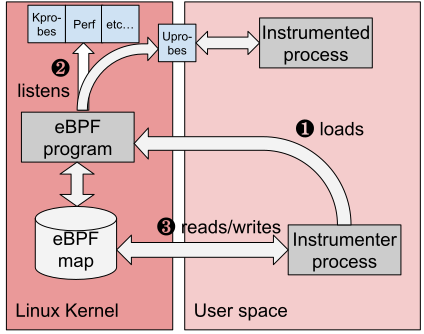
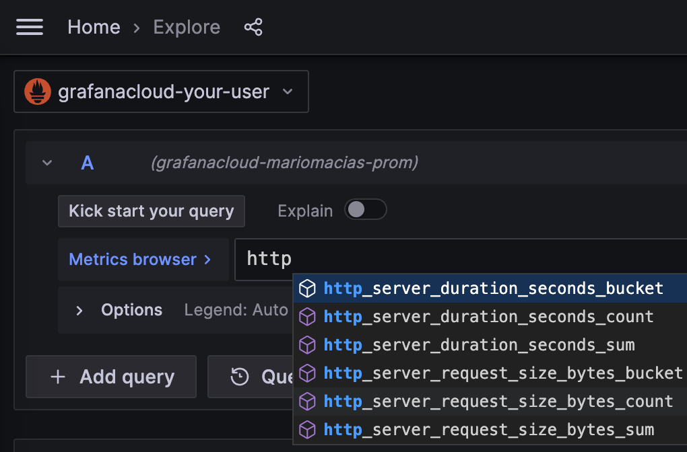

# Zero-code application traces and metrics with eBPF

> ⚠️**SOME GENERAL TO-DO's before releasing the Beta**
> * Change Dashboard URL and ID when we change the dashboard owner to Grafana
> * Update which languages and service types are finally supported.
> * Double-check conclusions & future work to update it according to the status of the
>   instrumenter.

Do you want to give a try to Grafana for application observability but don't have time
to adapt your application for it?

Until now, instrumenting an application to get metrics and traces required, in the best case,
to add a language agent to your deployment/packages. In languages like Go, you had to manually
add tracepoints into your code. In both cases, you need to redeploy the instrumented version
of the service to your staging/production servers.

To flatten the curve of adoption of Application Observability, Grafana is releasing an
eBPF autoinstrumentation suite that is able to report basic transactions span information,
as well as [Rate-Errors-Duration (RED) metrics](/blog/2018/08/02/the-red-method-how-to-instrument-your-services/)
for your Linux HTTP/S and gRPC services, without requiring to modify the code
to manually insert probes.

## E-B-P...what?

eBPF stands for Extended Berkeley Packet Filter, and allows attaching your own programs to
different points of the Linux Kernel. eBPF programs run in privileged mode to allow inspecting
runtime information from different parts of your Kernel: system calls, network stack, and
even inserting probes in your user space programs.

The eBPF programs are safe, as they are compiled for their own
[Virtual Machine instruction set](https://docs.kernel.org/bpf/instruction-set.html)
and then can run in a sandboxed environment that preverifies each
loaded program for safe memory access and finite execution time. Unlike older technologies
such as the older, native-compiled Kprobes and Uprobes, there is no chance that a poorly
programmed probe makes your Kernel hang.

After being verified, the eBPF binaries are compiled Just-In-Time (JIT) to the host
native architecture (x86-64, ARM64, ...) for efficient and fast execution.

The eBPF code is loaded from ordinary programs running in the user space, and both
kernel and user space programs can share information
through a set of communication mechanisms that are provided by the eBPF specification:
ring buffers, arrays, hash maps, etc.



## Running an instrumentable service

For testing the eBPF autoinstrument capabilities, you first need a service to instrument.
For this quick start tutorial, we recommend instrumenting any HTTP, HTTPS or gRPC Go service that uses any of
the following libraries:

* Standard `net/http`
* [Gorilla Mux](https://github.com/gorilla/mux)
* [Gin](https://gin-gonic.com/)
* [gRPC-Go](https://github.com/grpc/grpc-go)

Additionally, you can also instrument HTTP and HTTPs services written in other languages:
NodeJS, Python, Rust, Ruby, Java (only HTTP), etc.

If at this moment you don't have a concrete executable to instrument, you can create a simple
service just for testing. Create a `server.go` plain text file and open it in your editor
to paste the following code:

```go
package main

import (
	"net/http"
	"strconv"
	"time"
)

func handleRequest(rw http.ResponseWriter, req *http.Request) {
	status := 200
	for k, v := range req.URL.Query() {
		if len(v) == 0 {
			continue
		}
		switch k {
		case "status":
			if s, err := strconv.Atoi(v[0]); err == nil {
				status = s
			}
		case "delay":
			if d, err := time.ParseDuration(v[0]); err == nil {
				time.Sleep(d)
			}
		}
	}
	rw.WriteHeader(status)
}

func main() {
	http.ListenAndServe(":8080", http.HandlerFunc(handleRequest))
}
```

The above HTTP service will accept any request in the port 8080, and allows
overriding the behavior by means of two query arguments:

* `status` will override the returned HTTP status code (which defaults to 200).
  For example `curl -v "http://localhost:8080/foo?status=404"` will return a 404
  status code.
* `delay` will artificially increase the service response time. For example
  `curl "http://localhost:8080/bar?delay=3s"` will require 3 seconds to send
  the response.

You can [download the server.go file from this tutorial](./server.go) and run it by:

```
$ go run server.go
```

## Downloading the Autoinstrument

> ℹ️ For simplicity, this tutorial shows how to manually run the Autoinstrument as an
ordinary operating system process. For more running modes, you can check the documentation about
[running the eBPF Autoinstrument as a Docker container](https://github.com/grafana/ebpf-autoinstrument/blob/main/docs/docker.md)
or [deploying the eBPF Autoinstrument in Kubernetes](https://github.com/grafana/ebpf-autoinstrument/blob/main/docs/k8s.md).

You can download the Autoinstrument executable directly with `go install`:

```
go install github.com/grafana/ebpf-autoinstrument/cmd/beyla@latest
```

## Instrumenting a running service

The eBPF Autoinstrument requires at least two configuration options to run:

* A selector of the executable to instrument. You can select it by executable name
  (`EXECUTABLE_NAME` environment variable) or by any port it has open
  (`OPEN_PORT` environment variable).
* A metrics exporter. For this tutorial, autoinstrumented metrics will be exported
  by a [Prometheus](https://prometheus.io/) scrape endpoint (`BEYLA_PROMETHEUS_PORT`
  environment variable), and some traces will be sent to the standard output
  (setting the `PRINT_TRACES=true` environment variable).

To know how to configure other exporters (for example, [OpenTelemetry](https://opentelemetry.io/)
traces and metrics), as well as extra configuration options, please check the
[configuration section in the documentation]().

After the service from the previous section is running, we can instrument it
by executing the `beyla` command that we previously downloaded with
`go install`, as seen in the [Downloading](#downloading-the-autoinstrument) section.

We will configure the eBPF autoinstrument to instrument the executable that owns
the port 8080, printing the traces via standard output and exposing RED metrics
in the `localhost:8999/metrics` HTTP endpoint.

Remember that you need administrator access to run the instrumenting process:

```
$ BEYLA_PROMETHEUS_PORT=8999 PRINT_TRACES=true OPEN_PORT=8080 sudo -E beyla
```

You can now test the instrumented service from another terminal:

```
$ curl "http://localhost:8080/hello"
$ curl "http://localhost:8080/bye"
```

After some logs, the `beyla` standard output should show the traces information
of the above requests:

```
2023-04-19 13:49:04 (15.22ms[689.9µs]) 200 GET /hello [::1]->[localhost:8080] size:0B
2023-04-19 13:49:07 (2.74ms[135.9µs]) 200 GET /bye [::1]->[localhost:8080] size:0B
```

The format is:

```
Request_time (response_duration) status_code http_method path source->destination request_size 
```

You can try to play with the `curl` command to see how it affects the traces.
For example, the following request would send a 6-bytes POST request and the service will
take 200ms to respond:

```
$ curl -X POST -d "abcdef" "http://localhost:8080/post?delay=200ms"
```

And the Autoinstrument standard output will show:

```
2023-04-19 15:17:54 (210.91ms[203.28ms]) 200 POST /post [::1]->[localhost:8080] size:6B
```

Optionally, in background, you can even generate some artificial load in another terminal:

```
$ while true; do curl "http://localhost:8080/service?delay=1s"; done
```

After playing for a while with the server running at the port 8080, you can query the
Prometheus metrics that are exposed in the port `8999`:

```
$ curl http://localhost:8999/metrics
# HELP http_server_duration_seconds duration of HTTP service calls from the server side, in milliseconds
# TYPE http_server_duration_seconds histogram
http_server_duration_seconds_bucket{http_method="GET",http_status_code="200",service_name="testserver",le="0.005"} 1
http_server_duration_seconds_bucket{http_method="GET",http_status_code="200",service_name="testserver",le="0.005"} 1
http_server_duration_seconds_bucket{http_method="GET",http_status_code="200",service_name="testserver",le="0.01"} 1

(... cutting for the sake of brevity ...)
```

Please check the [List of exported metrics]() document for an exhaustive list
of the metrics that can be exposed by the eBPF Autoinstrument.

## Sending data to Grafana Cloud

Once we have verified that our application is correctly instrumented, we can add a Prometheus
collector to read the autoinstrumented metrics and forwards them to Grafana Cloud.
You can get a [Free Account in the Grafana site](/pricing/).

There are two alternatives for reading the metrics and forwarding them to Grafana Cloud:
* [Install Prometheus in your host and configure the scrape and remote write to read-and-forward the metrics
  ](/docs/grafana-cloud/quickstart/noagent_linuxnode/#install-prometheus-on-the-node)
* Use the [Grafana Agent](/docs/agent/latest/), as this tutorial shows.

### Downloading and configuring the Grafana Agent Flow

> ⚠️ This section explains briefly how to download and configure the Grafana Agent Flow for
manual playground.
For a complete description of the Grafana Agent Flow setup and configuration process
and recommended modes,
you can refer to the [Install Grafana Agent Flow](/docs/agent/latest/flow/setup/install/)
documentation .

1. Go to the Latest [Grafana Agent Releases page](https://github.com/grafana/agent/releases/).
2. For the last version, pick up your preferred package and required architecture.
   * For example, downloading zipped 0.34.3 version for Intel/AMD 64-bit architecture:
     ```
     $ wget https://github.com/grafana/agent/releases/download/v0.34.3/grafana-agent-linux-amd64.zip
     $ unzip grafana-agent-linux-amd64.zip
     ```
3. Create a plain text file, for example named `ebpf-tutorial.river`, and copy there the
   following text, that will tell the Agent to scrape the prometheus metrics from the
   eBPF Autoinstrument and forward them to [Grafana Mimir](/oss/mimir/).
   ```
   prometheus.scrape "default" {
       targets = [{"__address__" = "localhost:8999"}]
       forward_to = [prometheus.remote_write.mimir.receiver]
   }
   prometheus.remote_write "mimir" {
       endpoint {
           url = env("MIMIR_ENDPOINT")
           basic_auth {
               username = env("MIMIR_USER")
               password = env("GRAFANA_API_KEY")
           }
       }
   }
   ```
   Observe that it is configured to scrape the metrics in the `localhost:8999` address,
   same as the value of the `BEYLA_PROMETHEUS_PORT` variable from the previous section. Also,
   the connection details to Grafana Mimir (endpoint and authentication), is going to
   be provided via environment variables.

### Running the Grafana Agent Flow with your Grafana Credentials.

In your Grafana Cloud Portal, click on the "Details" button in the "Prometheus" box. Then
get your Grafana Prometheus (Mimir) Remote Write endpoint, your username, and generate and
copy a Grafana API Key with metrics push privileges:


Now you run the Agent via using the above information to feed the
`MIMIR_ENDPOINT`, `MIMIR_USER` and `GRAFANA_API_KEY` environment variables:

```
$ export MIMIR_ENDPOINT="https://prometheus-prod-01-eu-west-0.grafana.net/api/prom/push"
$ export MIMIR_USER="123456"
$ export GRAFANA_API_KEY="your api key here"
$ AGENT_MODE=flow ./grafana-agent-linux-amd64 run ebpf-tutorial.river

ts=2023-06-29T08:02:58.761420514Z level=info msg="now listening for http traffic" addr=127.0.0.1:12345
ts=2023-06-29T08:02:58.761546307Z level=info trace_id=359c08a12e833f29bf21457d95c09a08 msg="starting complete graph evaluation"
(more logs....)
```

To verify that metrics are properly received by Grafana, you can go to the left panel,
choose the Explore tab and for your Prometheus data source, write `http_` in the
Metrics Browser input. You should see the new metric names in the autocomplete popup.



## Add the eBPF RED Metrics Dashboard

From now, you could start composing your PromQL queries for better visualization of
your autoinstrumented RED metrics; to save your time, we already provide a
[public dashboard with some basic information](/grafana/dashboards/19077-ebpf-red-metrics/).

To import it into your Grafana instance, choose "Dashboards" in the Grafana left panel,
then in the Dashboards page, click on the "New" dropdown and select "Import":


In the "Import via grafana.com" textbox, you can just copy the Grafana ID from the
[eBPF Red Metrics](/grafana/dashboards/19077-ebpf-red-metrics/)
dashboard: `19077`.

Rename it at your convenience, select the folder and, most important, select the
data source in the `prometheus-data-source` popup at the bottom.

And _voilà!_ you can see some of your RED metrics:


The dashboard contains the following parts:

* A list with the top slowest HTTP routes for all the instrumented services. Since you only
  have a single service, only an entry appears. If you configure the autoinstrumentation to
  [report the HTTP routes](),
  many entries could appear there, one for each HTTP path in the server.
* A list with the top slowest GRPC methods. Since the test service in this tutorial only
  serves HTTP, this table is empty.
* For each instrumented server, a list of RED metrics for the inbound (server) traffic. This includes:
  * Duration: average and top percentiles for both HTTP and gRPC traffic.
  * Request rate: number of requests per second, faceted by its HTTP or gRPC return code.
  * Error rate as a percentage of 5xx HTTP responses or non-zero gRPC responses over the total
    of requests. They are faceted by return code.
* For each instrumented server, a list of RED metrics for the outbound (client) traffic. In
  the above screenshot they are empty because the test service does perform HTTP or gRPC
  calls to other services.
  * The Duration, Request Rate and Errors charts are analogues to the inbound traffic charts,
    with the only difference that 4xx return codes are also considered errors in the
    client side.

In the top of the chart, you can use the "Service" dropdown to filter the services you
want to visualize.

## Conclusions and future work

eBPF proved to be a fast, safe, and reliable way to observe some basic metrics of your
services. The Grafana eBPF Autoinstrument won't replace your language
agents but will decrease the landing time of your applications in Grafana, as it does
neither need any modification, recompilation nor repackaging. Just run it together with your
service, and you will get the metrics.

eBPF also allows you to see some parts that manual instrumentation doesn't. For example,
the eBPF Autoinstrument is able to show you how much time a request is enqueued after
the connection is established, until its code is actually executed (requires [exporting
OpenTelemetry traces](),
but this function is not explained in this tutorial).

The eBPF Autoinstrument has its limitations too. As it provides generic metrics and
simple Spans information (not distributed traces, yet), language agents and manual
instrumentation is still recommended, so you can specify the granularity of each
part of the code to be instrumented, putting the focus on your critical operations.

Another limitation to consider is that the Autoinstrument requires to run with
elevated privileges; not actually a `root` user but at least it has to run with the
`CAP_SYS_ADMIN` capability. If you run it as a container (Docker, Kubernetes...), it
has to be privileged or add the `CAP_SYS_ADMIN` capability.

In the future, we plan to add metrics about other well-established protocols, like
database or message queuing connections.

Also, it is important to work on distributed tracing, then you won't get just isolated
spans, but you will be able to relate them with requests from other services
(web, database, messaging...). It is complex due to the implications of being able
to redo client-side headers and put them in the same context as server-side requests,
but we plan to do progressive advances, small steps towards distributed tracing.

Another future task is to reduce the surface of the code that requires administrative
privileges, executing a small eBPF loader with `root` or `CAP_SYS_ADMIN` privileges
and running the rest of data processing/exposition with normal user privileges.
