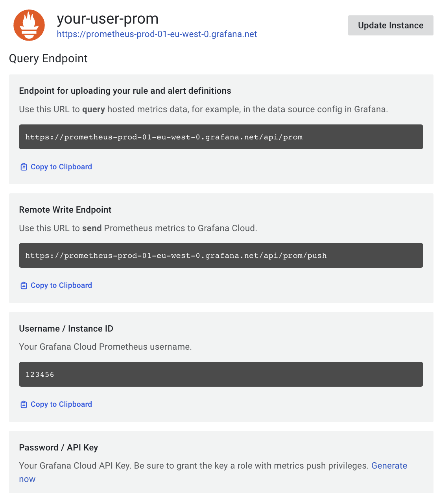
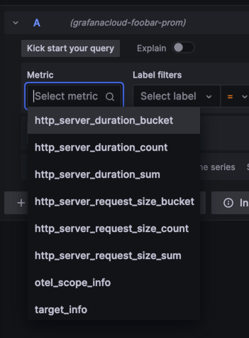
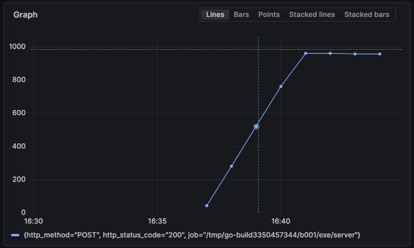

# Quick start tutorial

The eBPF autoinstrumenter allows reporting basic transaction information as well as
[RED metrics](https://grafana.com/files/grafanacon_eu_2018/Tom_Wilkie_GrafanaCon_EU_2018.pdf)
for Go HTTP/S and GRPC services in Linux, without requiring to modify the code
to manually insert probes.

>❗ This is an **experimental** feature that is not yet supported by Grafana Labs. ️

Requirements:
- Linux with Kernel 4.18 or higher
- eBPF enabled in the host
- The instrumented Go programs must have been compiled with Go 1.17 or higher
- Administrative access to execute the instrumenter
  - Or execute it from a user enabling the `SYS_ADMIN` capability.

## Downloading

> ℹ️ For help about how to download and run the autoinstrumenter as a container, you
can check the documentation about [running the eBPF autoinstrumenter as a Docker container](../docker.md)
or [running the eBPF autoinstrumenter in Kubernetes](../k8s.md).

In this tutorial, we will work with plan OS executables. You can download the
instrumenter executable directly with Go install:

```
go install github.com/grafana/ebpf-autoinstrument/cmd/otelauto@latest
```

## Running an instrumentable service

You can instrument any Go service that uses any of the following libraries:

* Standard `net/http`
* [Gorilla Mux](https://github.com/gorilla/mux)
* [Gin](https://gin-gonic.com/)
* [gRPC-Go](https://github.com/grpc/grpc-go)

If you don't have now any concrete executable to instrument, you can create a simple
service just for testing:

```go
package main

import (
	"net/http"
	"strconv"
	"time"
)

func handleRequest(rw http.ResponseWriter, req *http.Request) {
	status := 200
	for k, v := range req.URL.Query() {
		if len(v) == 0 {
			continue
		}
		switch k {
		case "status":
			if s, err := strconv.Atoi(v[0]); err == nil {
				status = s
			}
		case "delay":
			if d, err := time.ParseDuration(v[0]); err == nil {
				time.Sleep(d)
			}
		}
	}
	rw.WriteHeader(status)
}

func main() {
	http.ListenAndServe(":8080", http.HandlerFunc(handleRequest))
}
```

The above HTTP service will accept any request in the port 8080, and allows
overriding the behavior by means of two query arguments:

* `status` will override the returned HTTP status code (which defaults to 200).
  For example `curl -v "http://localhost:8080/foo?status=404"` will return a 404
  status code.
* `delay` will artificially increase the service response time. For example
  `curl "http://localhost:8080/bar?delay=3s"` will require 3 seconds to send
  the response.

You can [download the server.go file from this tutorial](server.go) and run it by:

```
$ go run server.go
```

## Instrumenting a running service

The eBPF autoinstrumenter requires at least two configuration options to run:

* A selector of the executable to instrument. You can select it by executable name
  (`EXECUTABLE_NAME` environment variable) or by any port it has open
  (`OPEN_PORT` environment variable).
* A metrics export endpoint. It can be an OpenTelemetry endpoint
  (`OTEL_EXPORTER_OTLP_ENDPOINT` environment variable), but for the moment we
  will just print the traces via standard output (setting the `PRINT_TRACES=true`
  environment variable).

Please check the [configuration section in the documentation](../config.md) to
see more configuration options.

So after the service from the previous section is running, we can execute the
`otelauto` that we previously downloaded with `go install`, as seen in the
[Downloading](#downloading) section.

We will configure it to instrument the executable that owns the port 8080, and
to just printing the traces via standard output (not reporting to any OpenTelemetry
endpoint).

Remember that you need administrator access to run the instrumenter:

```
$ PRINT_TRACES=true OPEN_PORT=8080 sudo -E otelauto
```

You can now test the instrumented service from another terminal:

```
$ curl "http://localhost:8080/hello"        
$ curl "http://localhost:8080/bye"
```

After some logs, the `otelauto` standard output should show the traces information
of the above requests:

```
2023-04-19 13:49:04 (15.22ms[689.9µs]) 200 GET /hello [::1]->[localhost:8080] size:0B
2023-04-19 13:49:07 (2.74ms[135.9µs]) 200 GET /bye [::1]->[localhost:8080] size:0B
```

The format is:

```
Request_time (response_duration) status_code http_method path source->destination request_size 
```

You can try to play with the `curl` command to see how it affects the traces.
For example, the following request would send a 6-bytes POST request and the service will
take 200ms to respond:

```
$ curl -X POST -d "abcdef" "http://localhost:8080/post?delay=200ms"
```

And the autoinstrumenter standard output will show:

```
2023-04-19 15:17:54 (210.91ms[203.28ms]) 200 POST /post [::1]->[localhost:8080] size:6B
```

## Sending data to Grafana Cloud

Once we have verified that our application is correctly instrumented, we can modify the
configuration of the Autoinstrumenter to send the data directly to Grafana Cloud.
You can get a [Free Account in the Grafana site](https://grafana.com/pricing/).  

> ⚠️ For simplicity, we will be [sending OpenTelemetry data directly to Grafana Cloud](https://grafana.com/docs/grafana-cloud/data-configuration/otlp/send-data-otlp/).
However, this is a preview feature that is not available in all the regions. Another option
is to [configure the Grafana Agent to process OpenTelemetry data and forward it to Grafana](https://grafana.com/docs/agent/latest/).

In your Grafana Cloud Portal, click on the "Details" button in the "Grafana" box. Then
get your Grafana Cloud Instance ID number and region, e.g.:



Also make sure you create an API Key in the "Security → API Keys" section of your Grafana
Cloud portal.

Now you can configure the Autoinstrumenter via the following environment variables.

```
export GRAFANA_INSTANCE_ID="123123"
export GRAFANA_API_KEY="abcabcabcabcabcabcab....bcabcabc="
export GRAFANA_REGION="prod-eu-west-0"

export OTEL_EXPORTER_OTLP_ENDPOINT="https://otlp-gateway-${GRAFANA_REGION}.grafana.net/otlp"
export OTEL_EXPORTER_OTLP_PROTOCOL="http/protobuf"
export OTEL_EXPORTER_OTLP_HEADERS="Authorization=Basic $(echo -n $GRAFANA_INSTANCE_ID:$GRAFANA_API_KEY | base64 -w 0)"
```

Change the `GRAFANA_INSTANCE_ID` and `GRAFANA_API_KEY` values by your own Grafana Cloud account
values. Change also the `GRAFANA_REGION` value by the Region that is listed in your own Grafana account.

Then run again the otel auto-instrumenter making sure that the environment is passed to the command
(flag `-E` in the `sudo` command):

```
$ OPEN_PORT=8080 sudo -E otelauto
```

You can generate some artificial load in another terminal:

```
while true; do curl -X POST -d "abcdef" "http://localhost:8080/post?delay=1s"; done
```

Now go to your Grafana main GUI and, in the left panel, click the "Explore" section.
Choosing the Prometheus dropdown, you will see some metrics that are reported by the
Autoinstrumenter:



So if you, for example, introduce the following PromQL query:

```
rate(http_server_duration_sum[$__rate_interval])
```

You will see a graph with the average request time (~1000ms according to the previous `curl` command):


