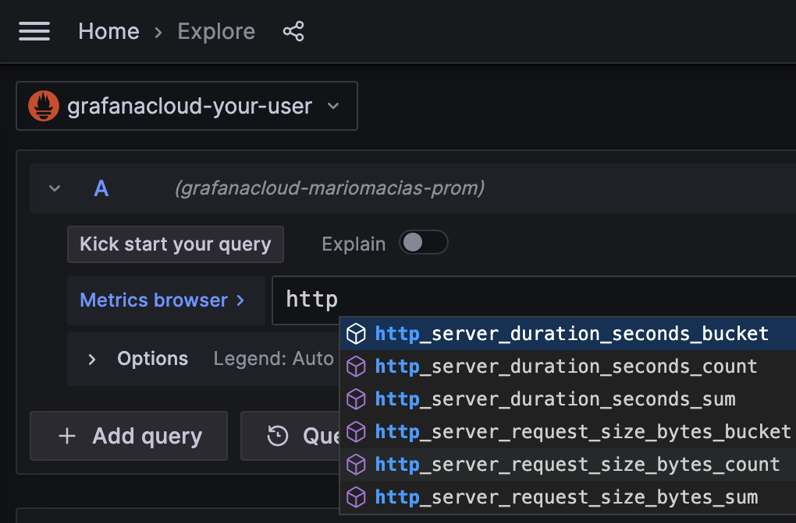

# Zero-code application traces and metrics with eBPF

> ⚠️**SOME GENERAL TO-DO's before releasing the Beta**
> * Change the current UI screenshots by the Dashboard that we are going to create an publish
>   in Grafana Cloud.
> * Update which languages and service types are finally supported.
> * Probably, do not configure metrics exporter and rely on SpanMetrics service to show
>   extra info, such as Service Maps, etc...
> * Double-check conclusions & future work to update it according to the status of the
>   instrumenter.

Do you want to give a try to Grafana for application observability but don't have time
to adapt your application for it?

Until now, instrumenting an application to get metrics and traces required, in the best case,
to add a language agent to your deployment/packages. In languages like Go, you had to manually
add tracepoints into your code. In both cases, you need to redeploy the instrumented version
of the service to your staging/production servers.

To flatten the curve of adoption of Application Observability, Grafana is releasing an
eBPF autoinstrumentation suite that is able to report basic transactions span information,
as well as [Rate-Errors-Duration (RED) metrics](https://grafana.com/blog/2018/08/02/the-red-method-how-to-instrument-your-services/)
for your Linux HTTP/S and gRPC services, without requiring to modify the code
to manually insert probes.

## E-B-P...what?

eBPF stands for Extended Berkeley Packet Filter, and allows attaching your own programs to
different points of the Linux Kernel. eBPF programs run in privileged mode to allow inspecting
runtime information from different parts of your Kernel: system calls, network stack, and
even inserting probes in your userspace programs.

The eBPF programs are safe, as they are compiled for their own
[Virtual Machine instruction set](https://docs.kernel.org/bpf/instruction-set.html)
and then can run in a sandboxed environment that preverifies each
loaded program for safe memory access and finite execution time. Unlike older technologies
such as the older, native-compiled Kprobes and Uprobes, there is no chance that a poorly
programmed probe makes your Kernel to hang.

After being verified, the eBPF binaries are compiled Just-In-Time (JIT) to the host
native architecture (x86-64, ARM64, ...) for efficient and fast execution.

The eBPF code is loaded from ordinary programs running in the user space, and both
kernel and user space programs can share information
through a set of communication mechanisms that are provided by the eBPF specification:
ring buffers, arrays, hash maps, etc.


## Downloading

> ℹ️ For simplicity, this tutorial shows how to manually run the auto-instrumenter as a
ordinary operating system process. For more running modes, you can check the documentation about
[running the eBPF autoinstrumenter as a Docker container](https://github.com/grafana/ebpf-autoinstrument/blob/main/docs/docker.md)
or [deploying the eBPF autoinstrumenter in Kubernetes](https://github.com/grafana/ebpf-autoinstrument/blob/main/docs/k8s.md).

You can download the instrumenter executable directly with `go install`:

```
go install github.com/grafana/ebpf-autoinstrument/cmd/otelauto@latest
```

## Running an instrumentable service

At the moment, you can instrument any Go service that uses any of the following libraries:

* Standard `net/http`
* [Gorilla Mux](https://github.com/gorilla/mux)
* [Gin](https://gin-gonic.com/)
* [gRPC-Go](https://github.com/grpc/grpc-go)

If you don't have now any concrete executable to instrument, you can create a simple
service just for testing:

```go
package main

import (
	"net/http"
	"strconv"
	"time"
)

func handleRequest(rw http.ResponseWriter, req *http.Request) {
	status := 200
	for k, v := range req.URL.Query() {
		if len(v) == 0 {
			continue
		}
		switch k {
		case "status":
			if s, err := strconv.Atoi(v[0]); err == nil {
				status = s
			}
		case "delay":
			if d, err := time.ParseDuration(v[0]); err == nil {
				time.Sleep(d)
			}
		}
	}
	rw.WriteHeader(status)
}

func main() {
	http.ListenAndServe(":8080", http.HandlerFunc(handleRequest))
}
```

The above HTTP service will accept any request in the port 8080, and allows
overriding the behavior by means of two query arguments:

* `status` will override the returned HTTP status code (which defaults to 200).
  For example `curl -v "http://localhost:8080/foo?status=404"` will return a 404
  status code.
* `delay` will artificially increase the service response time. For example
  `curl "http://localhost:8080/bar?delay=3s"` will require 3 seconds to send
  the response.

You can [download the server.go file from this tutorial](server.go) and run it by:

```
$ go run server.go
```

## Instrumenting a running service

The eBPF autoinstrumenter requires at least two configuration options to run:

* A selector of the executable to instrument. You can select it by executable name
  (`EXECUTABLE_NAME` environment variable) or by any port it has open
  (`OPEN_PORT` environment variable).
* A metrics export endpoint. It can be an OpenTelemetry endpoint
  (`OTEL_EXPORTER_OTLP_ENDPOINT` environment variable), but for the moment we
  will just print the traces via standard output (setting the `PRINT_TRACES=true`
  environment variable).

Please check the [configuration section in the documentation](../config.md) to
see more configuration options.

So after the service from the previous section is running, we can execute the
`otelauto` that we previously downloaded with `go install`, as seen in the
[Downloading](#downloading) section.

We will configure it to instrument the executable that owns the port 8080, and
to just printing the traces via standard output (not reporting to any OpenTelemetry
endpoint).

Remember that you need administrator access to run the instrumenter:

```
$ PRINT_TRACES=true OPEN_PORT=8080 sudo -E otelauto
```

You can now test the instrumented service from another terminal:

```
$ curl "http://localhost:8080/hello"        
$ curl "http://localhost:8080/bye"
```

After some logs, the `otelauto` standard output should show the traces information
of the above requests:

```
2023-04-19 13:49:04 (15.22ms[689.9µs]) 200 GET /hello [::1]->[localhost:8080] size:0B
2023-04-19 13:49:07 (2.74ms[135.9µs]) 200 GET /bye [::1]->[localhost:8080] size:0B
```

The format is:

```
Request_time (response_duration) status_code http_method path source->destination request_size 
```

You can try to play with the `curl` command to see how it affects the traces.
For example, the following request would send a 6-bytes POST request and the service will
take 200ms to respond:

```
$ curl -X POST -d "abcdef" "http://localhost:8080/post?delay=200ms"
```

And the autoinstrumenter standard output will show:

```
2023-04-19 15:17:54 (210.91ms[203.28ms]) 200 POST /post [::1]->[localhost:8080] size:6B
```

## Sending data to Grafana Cloud

Once we have verified that our application is correctly instrumented, we can modify the
configuration of the Autoinstrumenter to send the data directly to Grafana Cloud.
You can get a [Free Account in the Grafana site](https://grafana.com/pricing/).  

> ⚠️ For simplicity, we will be [sending OpenTelemetry data directly to Grafana Cloud](https://grafana.com/docs/grafana-cloud/data-configuration/otlp/send-data-otlp/).
However, this is a preview feature that is not available in all the regions. Another option
is to [configure the Grafana Agent to process OpenTelemetry data and forward it to Grafana](https://grafana.com/docs/agent/latest/).

In your Grafana Cloud Portal, click on the "Details" button in the "Grafana" box. Then
get your Grafana Cloud Instance ID number and region, e.g.:


Also make sure you create an API Key in the "Security → API Keys" section of your Grafana
Cloud portal.

Now you can configure the Autoinstrumenter via the following environment variables.

```
export GRAFANA_INSTANCE_ID="123123"
export GRAFANA_API_KEY="abcabcabcabcabcabcab....bcabcabc="
export GRAFANA_REGION="prod-eu-west-0"

export OTEL_EXPORTER_OTLP_ENDPOINT="https://otlp-gateway-${GRAFANA_REGION}.grafana.net/otlp"
export OTEL_EXPORTER_OTLP_PROTOCOL="http/protobuf"
export OTEL_EXPORTER_OTLP_HEADERS="Authorization=Basic $(echo -n $GRAFANA_INSTANCE_ID:$GRAFANA_API_KEY | base64 -w 0)"
```

Change the `GRAFANA_INSTANCE_ID` and `GRAFANA_API_KEY` values by your own Grafana Cloud account
values. Change also the `GRAFANA_REGION` value by the Region that is listed in your own Grafana account.

Then run again the otel auto-instrumenter making sure that the environment is passed to the command
(flag `-E` in the `sudo` command):

```
$ OPEN_PORT=8080 sudo -E otelauto
```

You can generate some artificial load in another terminal:

```
while true; do curl -X POST -d "abcdef" "http://localhost:8080/post?delay=1s"; done
```

Now go to your Grafana main GUI and, in the left panel, click the "Explore" section.
Choosing the Prometheus dropdown, you will see some metrics that are reported by the
Autoinstrumenter:



So if you, for example, introduce the following PromQL query:

```
rate(http_server_duration_sum[$__rate_interval])
```

You will see a graph with the average request time (~1000ms according to the previous `curl` command):


## Conclusions and future work

eBPF proved to be a fast, safe, and reliable way to observe some basic metrics of your
services. The Grafana eBPF autoinstrumenter won't replace your language
agents but will decrease the landing time of your applications in Grafana, as it does
neither need any modification, recompilation nor repackaging. Just run it together with your
service, and you will get the metrics.

eBPF also allows you seeing some parts that manual instrumentation doesn't. For example,
the eBPF autoinstrumenter is able to show you how much time a request is enqueued after
the connection is established, until its code is actually executed.

The eBPF autoinstrumenter has its limitations too. As it provides generic metrics and
simple Spans information (not distributed traces, yet), language agents and manual
instrumentation is still recommended, so you can specify the granularity of each
part of the code to be instrumented, putting the focus on your critical operations.

Another limitation to consider is that the autoinstrumenter requires to run with
elevated privileges; not actually a `root` user but at least it has to run with the
`CAP_SYS_ADMIN` capability. If you run it as a container (Docker, Kubernetes...), it
has to be privileged or add the `CAP_SYS_ADMIN` capability.

In the future, we plan to increase the base of supported languages. While we initially
started on Go, we plan to increase its codebase to other major languages, and providing
a fallback instrumenter that directly inspects the HTTP requests in the Kernel side,
so you can get metrics even for languages that haven't been explicitly supported.

Also, it is important to work on distributed tracing, then you won't get just small
spans information, but you will be able to relate them with requests from other services
(web, database, messaging...). It is a complex topic because it requires modifying
each request header to insert a trace ID to allow Grafana backend relating all the
spans into a single trace.
